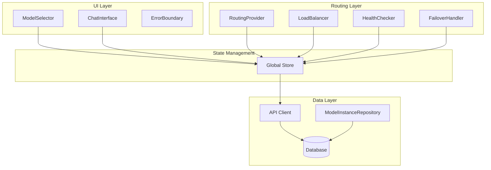

# System Architecture Documentation

## 1. High-Level Architecture



## 2. Component Responsibilities

### UI Layer
- **ModelSelector**: 
  - Manages model selection
  - Triggers instance selection
  - Handles model availability states

- **ChatInterface**:
  - Manages chat interactions
  - Displays messages
  - Handles message sending states

### Routing Layer
- **RoutingProvider**:
  ```
  RoutingProvider
    ├── LoadBalancer
    ├── HealthChecker
    └── FailoverHandler
  ```

- **LoadBalancer**:
  - Round-robin instance selection
  - Health-based filtering
  - Load distribution

- **HealthChecker**:
  - Periodic health monitoring
  - Health score updates
  - Failure detection

- **FailoverHandler**:
  - Failure counting
  - Instance failover
  - System stability maintenance

## 3. Data Flow

### Model Selection Flow
```
ModelSelector
  → selectModelAndInstance()
  → Store.setSelectedModel()
  → RoutingProvider
  → LoadBalancer.selectInstance()
```

### Health Monitoring Flow
```
HealthChecker
  → checkHealth()
  → Store.updateInstanceHealth()
  → FailoverHandler.monitor()
  → LoadBalancer.rebalance()
```

### Chat Message Flow
```
ChatInterface
  → handleSubmit()
  → Store.addMessage()
  → API.sendMessage()
  → Database.persist()
```

## 4. Error Handling

### Boundary Protection
```tsx
<ErrorBoundary>
  <RoutingProvider>
    <LoadBalancer />
    <HealthChecker />
    <FailoverHandler />
  </RoutingProvider>
</ErrorBoundary>
```

### Error Propagation
1. Component-level errors → ErrorBoundary
2. API errors → Store → UI
3. Health check failures → FailoverHandler
4. Database errors → Repository → API

## 5. State Management

### Store Structure
```typescript
Store
  ├── Instance State
  │   ├── instances[]
  │   ├── selectedInstance
  │   └── instanceHealth{}
  │
  └── Chat State
      ├── messages[]
      └── selectedModel
```
